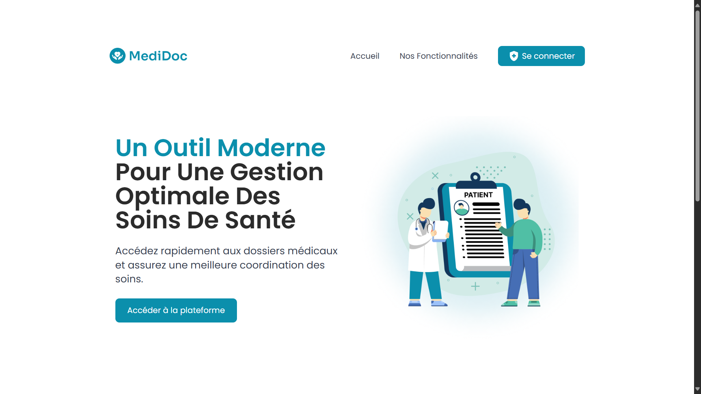
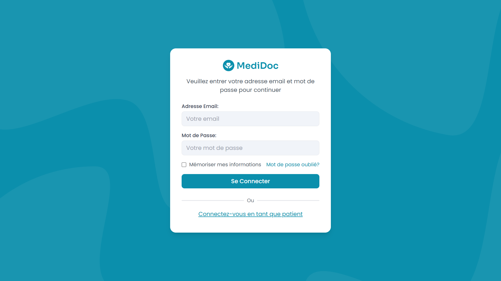
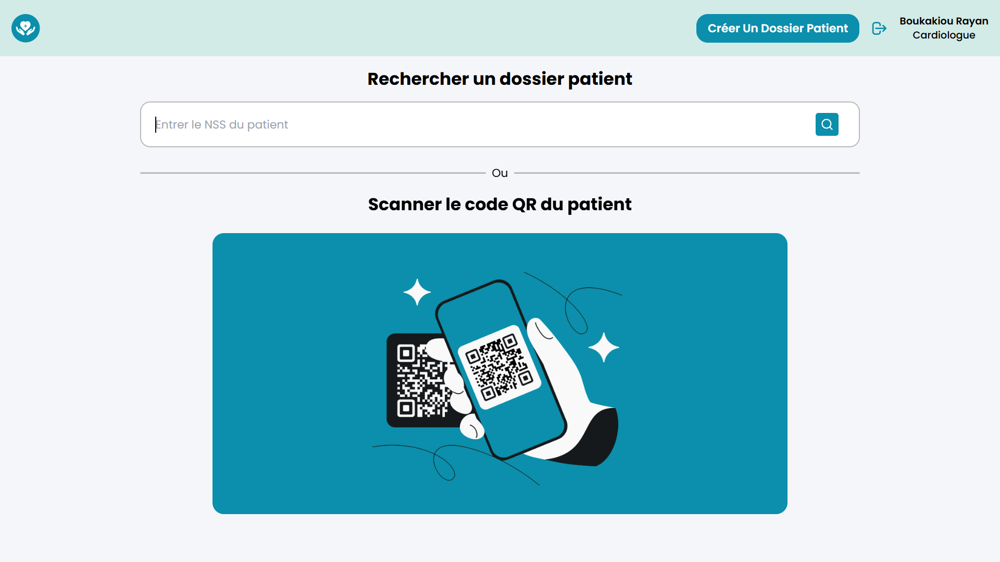
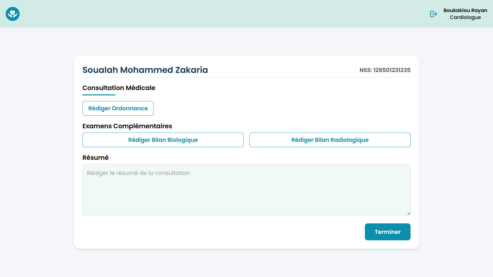
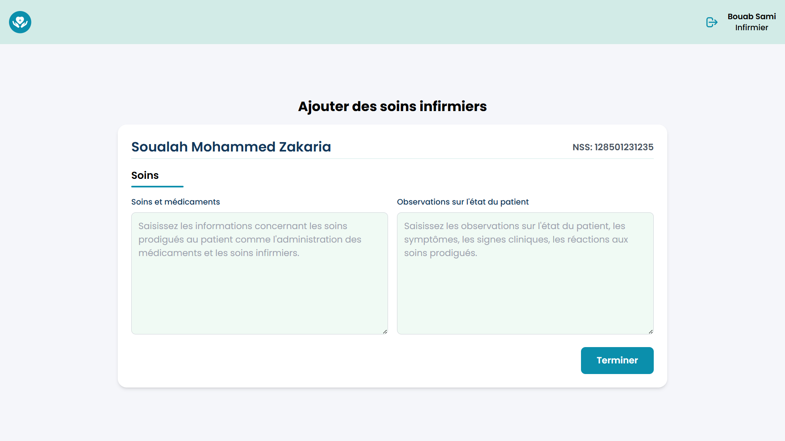
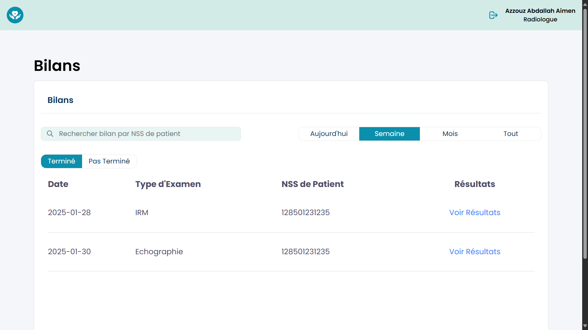

# MediDoc - Digital Patient Record (DPI) — Frontend

This repository contains the **frontend** for the Digital Patient Record (DPI) management system. The goal of the platform is to consolidate and centralize patient data—such as medical history, treatments, test results, and prescriptions—into a single, easily accessible digital file. By improving communication between healthcare professionals, this system helps streamline workflows and provides more consistent care for patients.

## Table of Contents
1. [Project Overview](#project-overview)  
2. [Key Features](#key-features)  
3. [Tech Stack](#tech-stack)  
4. [Getting Started](#getting-started)  
5. [Running the Application](#running-the-application)  
6. [Code Scaffolding](#code-scaffolding)  
7. [Building](#building)  
8. [Further Reading & References](#further-reading--references)  

---

## Project Overview

The **Digital Patient Record (DPI)** is designed to make patient data management as efficient and transparent as possible. By using the DPI, healthcare professionals (doctors, nurses, pharmacists, lab technicians, etc.) can readily access, update, and share patient information. This reduces administrative overhead, minimizes paperwork, and ensures that medical data is synchronized across the entire organization.

### Why MediDoc?
- **Better Patient Care**: Provides quick access to patient history and treatment records.
- **Improved Coordination**: Enables different departments to share updates, results, and prescriptions in real time.
- **Reduced Errors**: Minimizes duplicated tests, missing information, and prescription errors.
  
<div style="display: flex; flex-wrap: wrap; justify-content: space-around;">
  
  
  
  
  
  
</div>

---

## Key Features

1. **Patient Admission**  
   - Create a digital record with identification details and basic administrative data.
2. **Medical Consultations**  
   - Quickly retrieve a patient’s file by SSN or by scanning a QR code.
3. **Diagnosis & Prescription**  
   - Record visit summaries, prescribe medications, and order additional tests.
4. **Nursing Care**  
   - Track nursing interventions, from administering medications to monitoring patient conditions.
5. **Pharmacy Management**  
   - Access the in-house Hospital Pharmacy Management System (HPMS) to verify and dispense prescriptions.
6. **Lab & Imaging**  
   - Input test results and upload imaging directly into the system.
7. **Patient Self-Service**  
   - Allow patients to view their records, request medical certificates, and access a summary of hospital fees.

---

## Tech Stack

- **Framework**: [Angular](https://angular.io/) (TypeScript-based)
- **Language**: [TypeScript](https://www.typescriptlang.org/)
- **Build & Tooling**: [Angular CLI](https://angular.dev/tools/cli)

---

## Getting Started

### Prerequisites
1. **Node.js** (version 14 or higher)  
   - [Download Node.js](https://nodejs.org/en/download/)
2. **Angular CLI**  
   ```bash
   npm install -g @angular/cli
   ```

### Installation
1. **Clone the Repository**  
   ```bash
   git clone https://github.com/soualahmohammedzakaria/MediDoc.git
   cd MediDoc
   ```
2. **Install Dependencies**  
   ```bash
   npm install
   ```

---

## Running the Application

After installing the dependencies, start the development server:
```bash
ng serve -- open
```
Open your browser and navigate to:  
**[http://localhost:4200/](http://localhost:4200/)**

> **Note**: The application automatically reloads when changes are detected in the source files.

---

## Code Scaffolding

Angular CLI provides a quick way to generate components, services, modules, pipes, etc.:

```bash
ng generate component my-new-component
```

To see all available blueprints (such as `services`, `directives`, or `pipes`), run:
```bash
ng generate --help
```

*Reference:*  
- [Angular CLI Command Reference](https://angular.dev/cli)

---

## Building

Compile your project for production optimizations:

```bash
ng build
```
By default, the build artifacts are stored in the `dist/` folder. For more details on customizing your build:
- [Angular Deployment Guide](https://angular.io/guide/deployment)


---

## Further Reading & References

- [MediDoc Backend](https://github.com/soualahmohammedzakaria/MediDoc-Backend)
- [MediDoc SGPH](https://github.com/soualahmohammedzakaria/MediDoc-SGPH)
- [Angular Official Documentation](https://angular.io/docs)  
- [TypeScript Handbook](https://www.typescriptlang.org/docs/handbook/intro.html)  
- [Angular CLI Overview](https://angular.dev/tools/cli)  
- [WHO Guidelines for Digital Health Implementation](https://www.who.int/publications/i/item/9789240029202)

---

**Thank you for checking out the Digital Patient Record (DPI) MediDoc — Frontend project.** If you have any questions, suggestions, or feedback, feel free to open an issue or submit a pull request.  

*Maintained by the MediDoc Team.*
